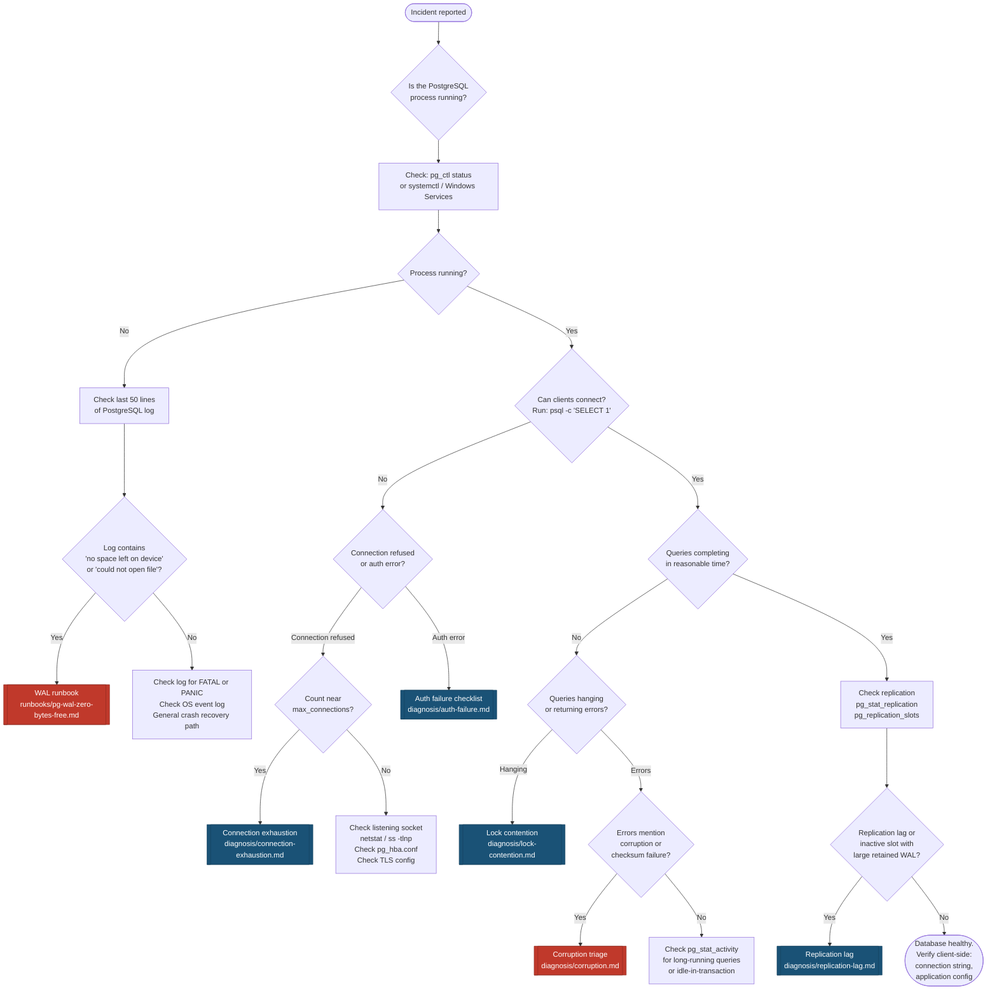

# Triage Flowchart

Start here when an incident is reported. Follow the decision nodes in sequence. Each leaf node points to a diagnosis checklist or runbook. You should reach an initial hypothesis within 5 minutes.

> [!NOTE]
> During a P1, log every decision node you traverse with a timestamp in the incident ticket. "14:38 — confirmed process running, checked connections" is enough. This feeds directly into the post-mortem timeline.

---

## Flowchart



---

## Flowchart Legend

| Symbol | Meaning |
|---|---|
| Rounded rectangle | Start / End |
| Diamond | Decision — requires a check |
| Rectangle | Action to perform |
| `[[ ]]` Red | Critical path — runbook or corruption |
| `[[ ]]` Blue | Diagnosis checklist |

---

## First Checks Reference

**Is the process running?**

```bash
# Linux — systemd
systemctl status postgresql
systemctl status postgresql@15-main   # Debian/Ubuntu naming

# Linux — pg_ctl
pg_ctl status -D /var/lib/postgresql/15/main

# macOS — Homebrew
brew services info postgresql@15
```

```powershell
# Windows — Services
Get-Service -Name "postgresql*" | Select-Object Name, Status

# Windows — pg_ctl
& "C:\Program Files\PostgreSQL\15\bin\pg_ctl.exe" status -D "C:\Program Files\PostgreSQL\15\data"
```

**Can clients connect?**

```bash
psql -h localhost -p 5432 -U postgres -c "SELECT 1"
```

**Connection count vs limit:**

```sql
-- Returns current connections / max_connections.
-- If pct_used is above 90%, connection exhaustion is the likely cause.
SELECT count(*) AS current_connections,
       (SELECT setting::int FROM pg_settings WHERE name = 'max_connections') AS max_connections,
       round(100.0 * count(*) /
         (SELECT setting::int FROM pg_settings WHERE name = 'max_connections'), 1) AS pct_used
FROM pg_stat_activity;
```

**Check PostgreSQL log (last 50 lines):**

```bash
# Linux — typical log locations
tail -50 /var/log/postgresql/postgresql-15-main.log
journalctl -u postgresql --no-pager -n 50
```

```powershell
# Windows
Get-Content "C:\Program Files\PostgreSQL\15\data\log\postgresql-*.log" -Tail 50
```

---

## Cross-Reference

- Severity definitions: [`severity-classification/matrix.md`](../severity-classification/matrix.md)
- If escalation is needed before you reach a leaf node: [`escalation/protocol.md`](../escalation/protocol.md)
