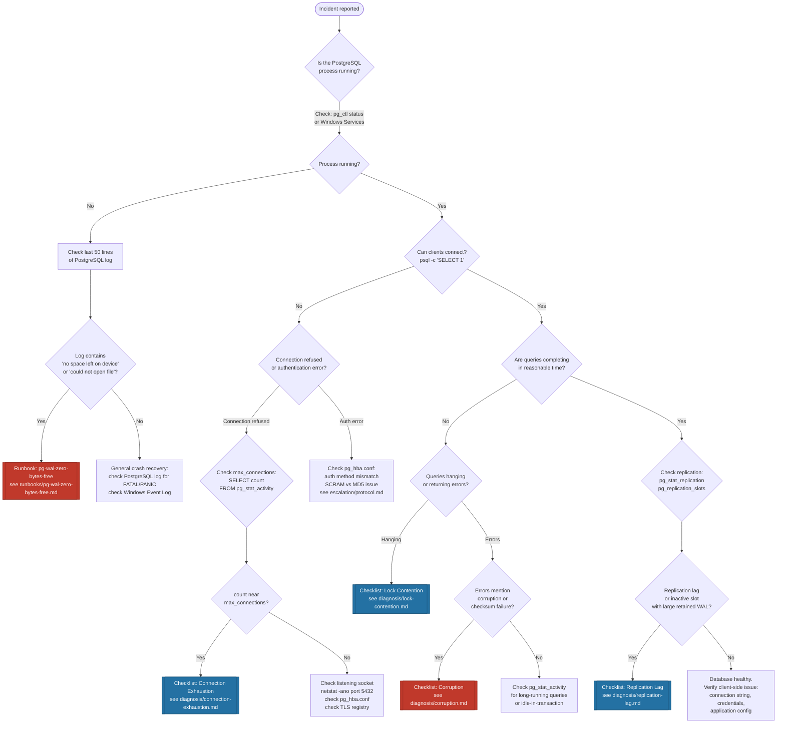

# Triage Flowchart

Start here when an incident is reported. Follow the decision nodes in sequence. Each leaf node points to a diagnosis checklist or runbook. You should reach an initial hypothesis within 5 minutes.

During a P1, log every decision node you traverse with a timestamp in the incident ticket. This feeds directly into the post-mortem timeline.

> [!NOTE]
> Every decision branch you follow during a P1 must be recorded with a timestamp. "14:38 — confirmed process running, checked connections" is enough. This is not bureaucracy — it's the raw material for the post-mortem timeline.

---

## Flowchart



---

## Flowchart Legend

| Symbol | Meaning |
|---|---|
| Rounded rectangle | Start / End point |
| Diamond `{ }` | Decision node — requires a check |
| Rectangle | Action to perform |
| `[[ ]]` Red | Runbook or checklist — critical path |
| `[[ ]]` Blue | Diagnosis checklist |

---

## First checks reference

When you reach a decision node, these are the exact commands to run:

**Is the process running?**
```powershell
# Windows — check service state
Get-Service -Name "postgresql*" | Select-Object Name, Status

# Or via pg_ctl (replace path with your installation)
& "C:\Program Files\PostgreSQL\15\bin\pg_ctl.exe" status -D "C:\Program Files\PostgreSQL\15\data"
```

**Can clients connect?**
```bash
psql -h localhost -p 5432 -U postgres -c "SELECT 1"
```

**Connection count vs limit:**
```sql
-- Returns: current connections / max_connections setting
SELECT count(*) AS current_connections,
       (SELECT setting::int FROM pg_settings WHERE name = 'max_connections') AS max_connections
FROM pg_stat_activity;
```

**Check PostgreSQL log (last 50 lines):**
```powershell
# Replace with your actual log path
Get-Content "C:\Program Files\PostgreSQL\15\data\log\postgresql-*.log" -Tail 50
```

---

## Cross-Reference

- Severity definitions: [`severity-classification/matrix.md`](../severity-classification/matrix.md)
- If escalation is needed before you reach a leaf node: [`escalation/protocol.md`](../escalation/protocol.md)
